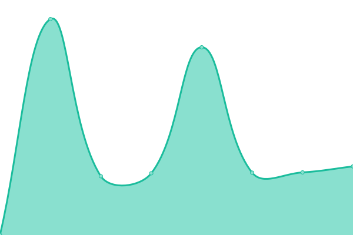

# [📈 Live Status](https://fornpunkt.github.io/dependency-monitor): <!--live status--> **🟩 All systems operational**

This repository contains the open-source uptime monitor and status page for [fornpunkt](https://fornpunkt.github.io/dependency-monitor), powered by [Upptime](https://github.com/upptime/upptime).

With [Upptime](https://upptime.js.org), you can get your own unlimited and free uptime monitor and status page, powered entirely by a GitHub repository. We use [Issues](https://github.com/fornpunkt/dependency-monitor/issues) as incident reports, [Actions](https://github.com/fornpunkt/dependency-monitor/actions) as uptime monitors, and [Pages](https://fornpunkt.github.io/dependency-monitor) for the status page.

<!--start: status pages-->
<!-- This summary is generated by Upptime (https://github.com/upptime/upptime) -->
<!-- Do not edit this manually, your changes will be overwritten -->
<!-- prettier-ignore -->
| URL | Status | History | Response Time | Uptime |
| --- | ------ | ------- | ------------- | ------ |
|  [Fornsök API (Riksantikvarieämbetet)](https://app.raa.se/open/fornsok/api/lamning/lamning/94bd12fc-39d9-465f-976a-82f02139f1dd) | 🟩 Up | [fornsoek-api-riksantikvarieaembetet.yml](https://github.com/fornpunkt/dependency-monitor/commits/HEAD/history/fornsoek-api-riksantikvarieaembetet.yml) | 

 1973ms
     
 | 

<a href="https://fornpunkt.github.io/dependency-monitor/history/fornsoek-api-riksantikvarieaembetet">99.46%</a>
    

|  [Fornsök WMS (Riksantikvarieämbetet)](https://karta.raa.se/geo/arkreg_v1.0/wms?SERVICE=WMS&VERSION=1.1.1&REQUEST=GetMap&FORMAT=image%2Fpng&TRANSPARENT=true&TILED=true&LAYERS=arkreg_v1.0%3Apublicerade_lamningar_centrumpunkt&STYLES=&CQL_FILTER=antikvariskbedomningtyp_id%20IN%20(4%2C2%2C1)%20OR%20(antikvariskbedomningtyp_id%20%3D%205%20AND%20undersokningsstatustyp_id%20IN%20(2%2C1)%20OR%20skadestatustyp_id%20IN%20(3)%20OR%20aktualitetstatustyp_id%20IN%20(2))&WIDTH=256&HEIGHT=256&SRS=EPSG%3A3006&BBOX=565229.8651859611%2C6498043.784463292%2C565306.2166468805%2C6498120.135924212) | 🟩 Up | [fornsoek-wms-riksantikvarieaembetet.yml](https://github.com/fornpunkt/dependency-monitor/commits/HEAD/history/fornsoek-wms-riksantikvarieaembetet.yml) | 

 1124ms
     
 | 

<a href="https://fornpunkt.github.io/dependency-monitor/history/fornsoek-wms-riksantikvarieaembetet">99.46%</a>
    

|  [K-samsök (Riksantikvarieämbetet)](http://www.kulturarvsdata.se/ksamsok/api?method=search&query=thumbnailExists=j&x-api=test&hitsPerPage=500&recordSchema=xml&fields=itemId,thumbnail&startRecord=1) | 🟩 Up | [k-samsoek-riksantikvarieaembetet.yml](https://github.com/fornpunkt/dependency-monitor/commits/HEAD/history/k-samsoek-riksantikvarieaembetet.yml) | 

 5825ms
     
 | 

<a href="https://fornpunkt.github.io/dependency-monitor/history/k-samsoek-riksantikvarieaembetet">99.47%</a>
    

|  [OpenStreetMap TMS (OpenStreetMap Foundation)](https://c.tile.openstreetmap.org/6/33/20.png) | 🟩 Up | [open-street-map-tms-open-street-map-foundation.yml](https://github.com/fornpunkt/dependency-monitor/commits/HEAD/history/open-street-map-tms-open-street-map-foundation.yml) | 

 68ms
     
 | 

<a href="https://fornpunkt.github.io/dependency-monitor/history/open-street-map-tms-open-street-map-foundation">100.00%</a>
    

<!--end: status pages-->

[**Visit our status website →**](https://fornpunkt.github.io/dependency-monitor)

## 📄 License

- Powered by: [Upptime](https://github.com/upptime/upptime)
- Code: [MIT](./LICENSE) © [fornpunkt](https://fornpunkt.github.io/dependency-monitor)
- Data in the `./history` directory: [Open Database License](https://opendatacommons.org/licenses/odbl/1-0/)
